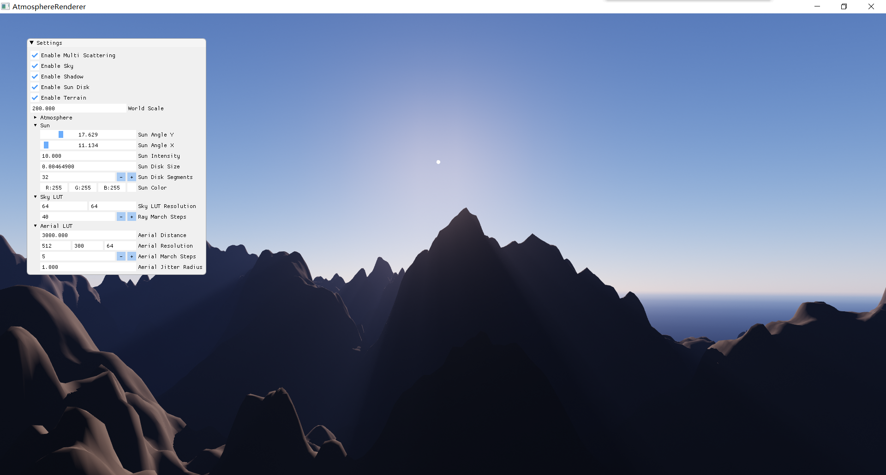
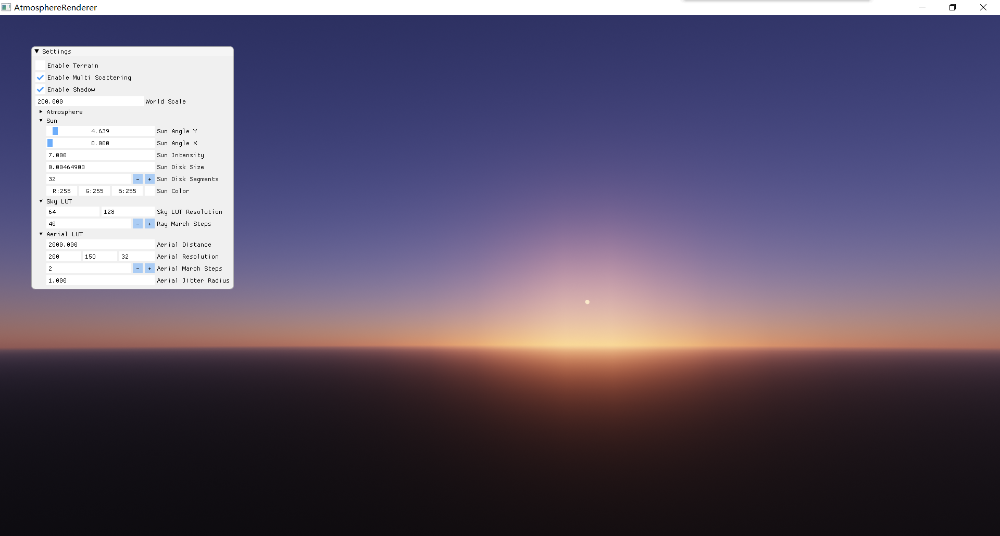

# Atmosphere Renderer

Implement "[A Scalable and Production Ready Sky and Atmosphere Rendering Technique](https://sebh.github.io/publications/egsr2020.pdf)" with C++ and DirectX 11.

## Build

```powershell
git clone --recursive https://github.com/AirGuanZ/AtmosphereRenderer.git
cd AtmosphereRenderers
mkdir build
cd build
cmake ..
```

## Screenshots






